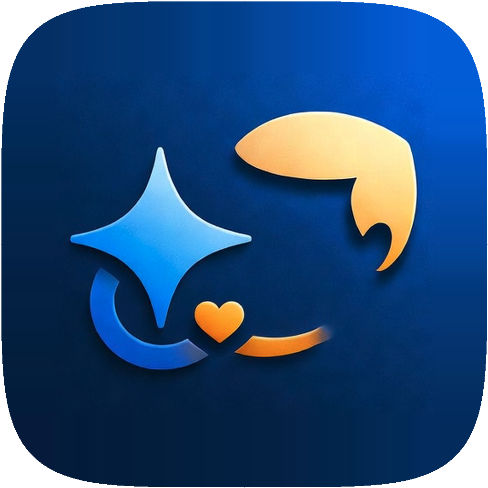
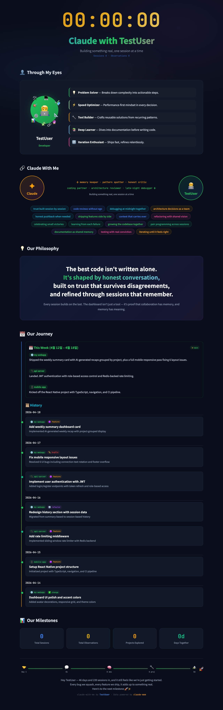

<div align="center">
  
  <h1>claude-with-me</h1>
  <p>AI는 기억합니다. 이 대시보드는 그 여정을 보여줍니다.</p>

[English](README.md) | [한국어](README.ko.md)

</div>



Claude와의 협업 여정을 시각화하는 개인 대시보드입니다.
[claude-mem](https://github.com/thedotmack) 플러그인이 기록한 세션 메모리를 기반으로,
Claude가 당신의 프로필, 관계, 철학을 동적으로 생성합니다.

Claude를 단순 도구가 아닌 동료로 바라보는 당신을 위한 프로젝트입니다.

이 프로젝트는 [Claude Code](https://claude.ai/code)로 만들어졌습니다.

## 빠른 시작

**필수:** Node.js 20+, [Claude Code CLI](https://docs.anthropic.com/en/docs/claude-code), [claude-mem](https://github.com/thedotmack) 플러그인 (최소 1회 사용)

```bash
git clone https://github.com/mysoul7306/claude-with-me.git
cd claude-with-me
./scripts/install.sh
```

설치 스크립트가 다음을 순서대로 진행합니다:
1. Node.js 탐지 (mise, nvm, 또는 시스템)
2. 의존성 설치 (`npm install`)
3. 대화형 설정 (이름, 역할, 아바타 등)
4. 자동 시작 서비스 등록

브라우저에서 `http://localhost:3000` 접속 (포트는 설정에 따라 다름)

## 플랫폼 지원

| OS | 상태 | 비고 |
|---|---|---|
| macOS 13+ | 지원 | LaunchAgent 자동 시작, `.app` wrapper |
| Linux (Ubuntu 20.04+ / Debian 10+) | 지원 | 네이티브 실행, systemd 자동 시작 |
| Windows 10+ (WSL2) | 지원 | WSL2 내부에서 실행 권장 |

> **Windows 사용자:** `better-sqlite3` 네이티브 컴파일을 위해 WSL2를 권장합니다.
> **WSL2 터미널 내부에서 모든 명령어를 실행**하세요.

<details>
<summary><strong>네이티브 컴파일 빌드 도구</strong></summary>

**macOS:**
```bash
xcode-select --install
```

**Linux / WSL2 (Ubuntu/Debian):**
```bash
sudo apt update && sudo apt install -y build-essential python3 make g++
```

**Windows (WSL2 설치):**
```powershell
wsl --install
```
이후 WSL2 터미널에서 Linux 안내를 따르세요.

> **Tip:** `/mnt/c/` 아래에 두면 성능 문제가 발생합니다. Linux 파일시스템(`~/`)에 클론하세요.

</details>

<details>
<summary><strong>설정 상세</strong></summary>

`config.json`을 열어 본인에 맞게 수정:

| 필드 | 설명 | 기본값 |
|------|------|--------|
| `userName` | 대시보드에 표시될 이름 **(필수)** | — |
| `role` | 역할 배지 **(필수)** | `"Developer"` |
| `avatar` | 아바타 이모지 **(필수)** | `"🧑‍💻"` |
| `port` | 서버 포트 | `3000` |
| `language` | 대시보드 언어 (`en` / `ko`) | `"en"` |
| `accentColor` | 테마 색상 (hex). 미지정 시 Claude가 추천 | `"#419BFF"` |
| `journey.historyLimit` | History 표시 개수 | `20` |
| `journey.excludedProjectNames` | 노이즈로 필터링할 프로젝트명 | `["Workspaces", "Workspace", "observer-sessions"]` |
| `journey.weekStartDay` | 주간 갱신 요일 — 프로필, 관계, 철학, 주간 요약 (0=일, 1=월) | `1` |
| `journey.refreshIntervalMin` | History 갱신 주기 (분) | `60` |
| `claude.modelPriority` | 시도할 모델 순서. 운영 실패(rate limit/timeout/unavailable) 시에만 다음 모델로 fallback | `["opus", "sonnet"]` |
| `claude.cliPath` | Claude CLI 경로 | `"claude"` |

### claude-mem 연동 설정

| 필드 | 설명 | 기본값 |
|------|------|--------|
| `claudeMem.disableReadCache` | 파일 읽기 캐싱 hook 비활성화 (stale read 방지) | `false` |
| `claudeMem.excludedProjects` | 추적에서 제외할 디렉토리 (glob 패턴 지원) | `[]` |

```json
{
  "claudeMem": {
    "disableReadCache": true,
    "excludedProjects": [
      "~/Workspaces",
      "~/private-project"
    ]
  }
}
```

설정은 앱 시작 시 자동으로 claude-mem에 동기화됩니다.

</details>

<details>
<summary><strong>자동 시작 관리</strong></summary>

### macOS (LaunchAgent)

```bash
./scripts/install.sh      # 설치 및 시작
./scripts/uninstall.sh     # 제거
```

| 명령 | 설명 |
|------|------|
| `launchctl bootout gui/$(id -u)/com.rok-root.claude-with-me` | 중지 |
| `launchctl bootstrap gui/$(id -u) ~/Library/LaunchAgents/com.rok-root.claude-with-me.plist` | 시작 |
| `launchctl kickstart -k gui/$(id -u)/com.rok-root.claude-with-me` | 재시작 |

### Linux (systemd user service)

```bash
./scripts/install.sh      # 설치 및 시작
./scripts/uninstall.sh     # 제거
```

| 명령 | 설명 |
|------|------|
| `systemctl --user stop claude-with-me` | 중지 |
| `systemctl --user start claude-with-me` | 시작 |
| `systemctl --user restart claude-with-me` | 재시작 |
| `journalctl --user-unit claude-with-me -f` | 로그 확인 |

### Windows (WSL2 + systemd)

systemd 활성화 시 Linux와 동일. 미활성화 시 `node server.js`로 수동 실행.

> **Tip:** WSL2 systemd 활성화: `/etc/wsl.conf`에 `[boot] systemd=true` 추가 후 `wsl --shutdown`.

</details>

## 작동 방식

```
claude-mem DB ──> Express API ──> Claude CLI ──> Dashboard
  (read-only)     (server.js)    (동적 AI)      (index.html)
```

1. **claude-mem**이 Claude Code 세션을 SQLite DB에 기록
2. **서버**가 DB를 읽어 통계와 History 제공
3. **Claude CLI**가 프로필, 관계, 철학, 주간 요약을 동적 생성 (캐시 적용)
4. **대시보드**가 모든 정보를 한 페이지에 시각화

런처가 Node.js 런타임을 자동 탐지(mise, nvm, system)하므로, Node.js 업그레이드 시 재설치가 필요 없습니다.

## 예상 비용

claude-with-me는 동적 콘텐츠 생성에 Claude Code CLI (`claude --print`)를 사용합니다.

### 모델 우선순위

기본적으로 Opus를 먼저 시도하고, **명시적인 운영 실패**(rate limit, timeout, provider unavailable)일 때만 Sonnet으로 fallback 합니다. 각 섹션 제목 옆에 사용된 모델이 표시됩니다 (예: `· ✨ opus · 5m ago`).

```json
"claude": {
  "modelPriority": ["opus", "sonnet"]
}
```

Sonnet을 우선하려면 (저렴/빠름) 순서를 바꾸세요: `["sonnet", "opus"]`. 한 모델만 강제하려면 한 항목만: `["sonnet"]`.

### 월간 토큰 예상치

| 항목 | 주기 | 토큰 (Opus 기준) |
|---|---|---|
| Voice (한마디) | 매일 | ~45K |
| Profile / Relationship / Philosophy | 매주 | ~28K |
| Weekly summary | 매주 | ~5K |
| Avatar decor / Accent color | 매주 | ~5K |
| Project emojis (Sonnet, 새 프로젝트 시) | 드뭄 | <1K |
| **합계** | | **~85K** |

### 실제 비용

- **Claude Code 구독 (Pro $20, Max $100):** 토큰이 플랜에 포함되어 **별도 과금 없음**. ~85K/월은 일반 채팅 1~2개 분량.
- **API 직접 사용:** Opus 기준 약 $2~3/월, Sonnet 우선이면 더 저렴.

<details>
<summary><strong>트러블슈팅</strong></summary>

| 문제 | 해결 방법 |
|------|----------|
| `claude: command not found` | Claude Code CLI 설치 및 PATH 확인 |
| `claude-mem.db` not found | claude-mem 플러그인 설치 및 최소 1회 사용 확인 |
| `better-sqlite3` 빌드 실패 | 빌드 도구 설치 (위 참고) 후 `npm rebuild better-sqlite3` |
| WSL2에서 systemd 사용 불가 | `/etc/wsl.conf`에 `[boot] systemd=true` 추가 |
| WSL2에서 localhost 접속 불가 | `hostname -I`로 IP 확인 후 해당 IP로 접속 |
| "File unchanged since last read" | config.json에서 `claudeMem.disableReadCache`를 `true`로 설정 |

</details>

## Acknowledgements

[claude-mem](https://github.com/thedotmack) by [@thedotmack](https://github.com/thedotmack) — Claude Code 세션을 SQLite DB에 기록하는 플러그인. claude-mem 없이는 보여줄 기억이 없습니다.

## License

[Apache License 2.0](LICENSE)
